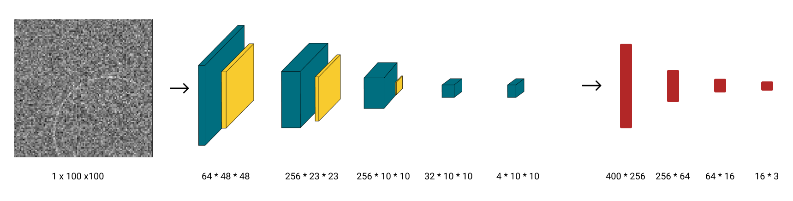

# Circle-Detection

Utilizing a CNN model to identify the location of the circle center and radius

## Quick Overview

### Model Architecture

- **ResNet18**  
    
  (Source: [10.1007/s10916-019-1475-2](https://doi.org/10.1007/s10916-019-1475-2))

- **Self-defined CNN**  
  

**Input:**
- ResNet18: 3-dimensional grayscale image
- Self-defined CNN: 1-dimensional grayscale image

**Output:**
- x: row of the circle center
- y: column of the circle center
- r: radius of the circle

## Getting Started

### Training

For training purposes, please use `CircleDetection-train.ipynb`.

### Test

For testing purposes, please use `CircleDetection-test.ipynb`.

### After Opening Colab

1. In Colab, choose the runtime type as Python and GPU.  
   (Colab > Runtime > Change runtime type)
2. Specify the image and model variables in Part 0
3. Run the entire Python code
4. Code running...
5. Training and testing results are shown at the bottom

#### Troubleshooting

If the model parameter file download fails, please download the model parameter file (e.g., `model_resnet18.pt`) from GitHub and upload it to Colab.  
(Colab left bar > Files > Upload to session storage)

## Analysis

| Model                         | ResNet18 | CNN    |
| ----------------------------- | -------- | ------ |
| Parameters                    | 11M      | 750K   |
| Mean IoU (Noise_LV=0.5)       | 98.79%   | 95.47% |
| Accuracy (IoU threshold=0.8)  | 99.85%   | 95.55% |
| Accuracy (IoU threshold=0.9)  | 98.75%   | 86.95% |
| Accuracy (IoU threshold=0.95) | 94.60%   | 73.60% |

The model performs well with a large number of parameters, achieving high mean IoU and accuracy. When a simple CNN is applied, the mean IoU slightly decreases by 3.32%, and accuracy drops by 4.3%, 11.2%, and 21% with respect to IoU thresholds of 0.8, 0.9, and 0.95, respectively. The results show that a Simple CNN has the ability to roughly predict the center location and radius, but accuracy drops when the threshold rises.

In conclusion, ResNet18 has better IoU and accuracy in all circumstances, but the number of parameters is larger, and training and inference times are longer. This is suitable for situations that require precise predictions with high computational ability. On the other hand, the number of parameters and training and inference times for CNN are dramatically lower and shorter, but it can only predict the rough location and radius of the circle. This is suitable for situations that only need rough predictions with low computational ability. If higher accuracy is required, building a slightly more complex Simple CNN can achieve the requirement.
